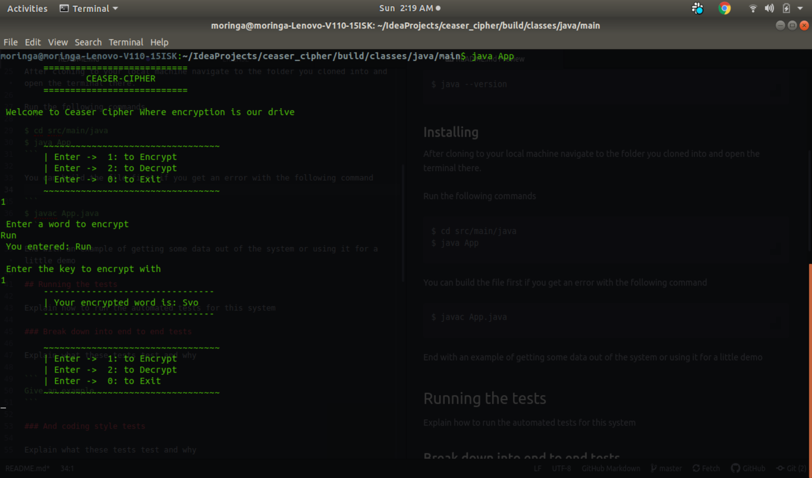

# Ceaser Cipher

This is a java project that can encrypt and decrypt a word using a key provided by the user
## Author

* **Arnold Oduma** 

### -*Initial works*-
  - [Github Search](https://github.com/ArnoldOduma/git-search) - An app to search github users and their repositories
  - [Quotes](https://github.com/ArnoldOduma/quotes) - An app that enables a user create quotes and delete quotes they don't want
  - [Goals](https://github.com/ArnoldOduma/goals-application) - This is an application to create goals and checkout the ones you completed
  - [Pig Dice](https://github.com/ArnoldOduma/Pig-Dice) - This is a simole java script game of pigdice
  - [Delani Studio](https://github.com/ArnoldOduma/Delani_Studio) - A front end of a studio website
  - [Triangle Tracker](https://github.com/ArnoldOduma/triangle-tracker) - Tracks what type a triangle is by checking its length width and height
  - [portfolio](https://github.com/ArnoldOduma/portfolio) - My portfolio website 

## Getting Started

Clone this repository to your local machine to get Started

Github: [https://github.com/ArnoldOduma/Ceaser-Cipher.git](https://github.com/ArnoldOduma/Ceaser-Cipher.git)

### Prerequisites

You need the following installed on your machine
- java
- JDK - Java Development Kit


To confirm run the following command on linux
```
$ java --version
```

### Installing

After cloning to your local machine navigate to the folder you cloned into and open the terminal there.

Run the following commands
```
$ cd src/main/java
$ java App
```

You can build the file first if you get an error with the following command

```
$ javac App.java
```

## Demo


## BDD
 Behavior: <br>*The program should:*       | Input:    | Output:     |
|:-------------|:------------- |:-------------|
| Take in a word from the user | Run | You entered: Run    |
| Take a key entered by user   | 1 | You entered: 1 |
| Encrypt the entered word using the given key   | Run | Svo |
|  Take in an encrypted word from the user  | Svo | You entered: Svo |
| Take a key entered by user   | 1 | You entered: 1 |
| Decrypt the entered word using the given key   | Svo | Run |

## Running the coding style tests

Create a test class for running tests in the application.

This is a sample test that tests if the getter method works

```
@Test
public void ceaseCipher_getmWord_String(){
  CeaserCipher testCeaser = new CeaserCipher("Hell0",1);
  assertEquals("Hello", testCeaser.getmWord());
}
```

## Built With

* [Java](https://www.java.com/) - The language used
* [Intellij Idea](https://www.jetbrains.com/idea/) - Intergated development


## Contributing
If you want to put out a pull request you first have to send us the sample code that you want to add to our repository for cross-checking before we allow the pull.

## Versioning

We use [Github](https://github.com/) for versioning. This is the first version of this application

## License

This project is licensed under the MIT License - see the [LICENSE](LICENSE) file for details

## Acknowledgments

* Hat tip to anyone whose code was used

